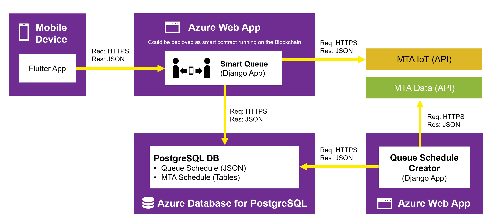

# DXC-Smart-Queue
**Business Value:** Our goal is to make it safer to use any public facility. Rather than predicting and restricting, we incentivize people (with a gaming experience) to look out for each other.
 
**Technical Innovation:** [Algorithmic mechanism design](https://en.wikipedia.org/wiki/Algorithmic_mechanism_design) is an under-used technique. We used it to reward those who willingly social distance.

**Business implementation:** The application uses Microsoft Azure’s native cloud services and scale. The roadmap to production requires customizing the application to a specific set of trains and times, deploying the system, and testing it.

## Overview
People respond a lot better when you make them part of the solution, not the problem. The transit system is complex and keeping it both useful and safe is difficult. What if instead of imposing travel restrictions, you gave people incentives to look out for each other? [Algorithmic mechanism design](https://en.wikipedia.org/wiki/Algorithmic_mechanism_design) lets you align the interests of each person with the common good. We built this technique into a system that we call the Smart Queue. The Smart Queue monitors the complex transit network and offers each rider real-time rewards for willingly keeping a safe social distance.

Choose where you want to be and when you want to be there. The Smart Queue estimates the social responsibility of each option, assigns points, and shows you the results. Choose whichever option you like, but the Smart Queue will gently nudge if more responsible choices are available. The better your choices, the more reward points you earn. You can check on the rewards you’ve earned at any time. The application notifies you of upcoming reservations or when, despite your best efforts, you might be entering an overcrowded zone.

## The App
Overview of the app and instructions for using it

## The Design
The app uses the Flutter framework to run natively on Android and iOS. The app communicates with the Smart Queue, which is implemented as Python/Django app running in Azure. The data pipeline pulls real-time information from the MTA and updates the Azure PostgreSQL Database—which feeds the Smart Queue. Each component is designed to scale separately using Azure's native cloud services.

### The Smart Queue
Overview of the Smart Queue

### The Data Lake
Overview of the data lake

### The Data Pipeline
Overview of the data pipeline

## Supporting Documents
Links to important documents
